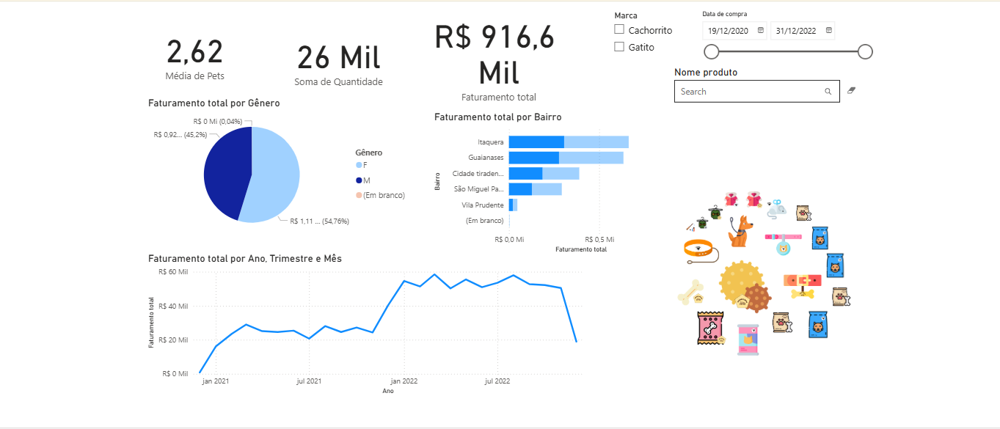

# Pet Store Financial Dashboard | Painel Financeiro Pet Store

## 📊 Dashboard Preview | Visualização do Dashboard

## 📊 Data Overview | Visão Geral dos Dados
**English:** This dashboard analyzes comprehensive pet store data including:
- **Sales Data**: Revenue, product categories
- **Customer Information**: Demographics, purchasing behavior, location
- **Temporal Analysis**: Monthly/quarterly sales trends, seasonal patterns
- **Geographic Distribution**: Sales for each location and regional performance
- **Product Performance**: Quantity sold by product , category analysis

**Português:** Este dashboard analisa dados abrangentes de pet shop incluindo:
- **Dados de Vendas**: Faturamento, categorias de produtos
- **Informações do Cliente**: Dados demográficos, comportamento de compra, localização
- **Análise Temporal**: Tendências de vendas mensais/trimestrais, padrões sazonais
- **Distribuição Geográfica**: Vendas para cada Localidade e desempenho regional
- **Desempenho de Produtos**: Quantidade vendida por produto, análise por categoria

## ✨ Key Features | Principais Funcionalidades
- **Timeseries financial analysis** | **Análise financeira temporal**
- **Interactive charts and filters** | **Gráficos e filtros interativos**
- **Client behavior analysis** | **Análise de comportamento do cliente**
- **Social and geographic analysis** | **Análise social e geográfica**

## 🔗 Live Dashboard | Dashboard Online
**Click the link below to open the interactive dashboard in a new tab:**
**Clique no link abaixo para abrir o dashboard interativo em uma nova aba:**

🔗 <a href="https://app.powerbi.com/view?r=eyJrIjoiMDc0NjdhZmEtZGY5MC00MWQ1LWE3OWItOWQ3MmZiZTc2YjYzIiwidCI6IjAyZGU0MmU3LTBjODUtNDNlNC1hYjIyLWQ4ZTM2MzJmMWE0NyJ9" target="_blank">View Interactive Dashboard on Power BI Service</a>

*Tip: Right-click → "Open in new tab"*
*Dica: Clique com botão direito → "Abrir em nova guia"*

## 📁 Files Included | Arquivos Incluídos
- `Dashboard.pbix` - Main Power BI file | Arquivo principal do Power BI
- `powerbi_image.png` - Dashboard screenshot | Captura de tela do dashboard

## 🚀 Getting Started | Como Usar
1. Open the Power BI Dashboard in a new tab | Abra o Dashboard do Power BI em uma nova guia
2. Start interacting with it | Comece a interagir com ele
